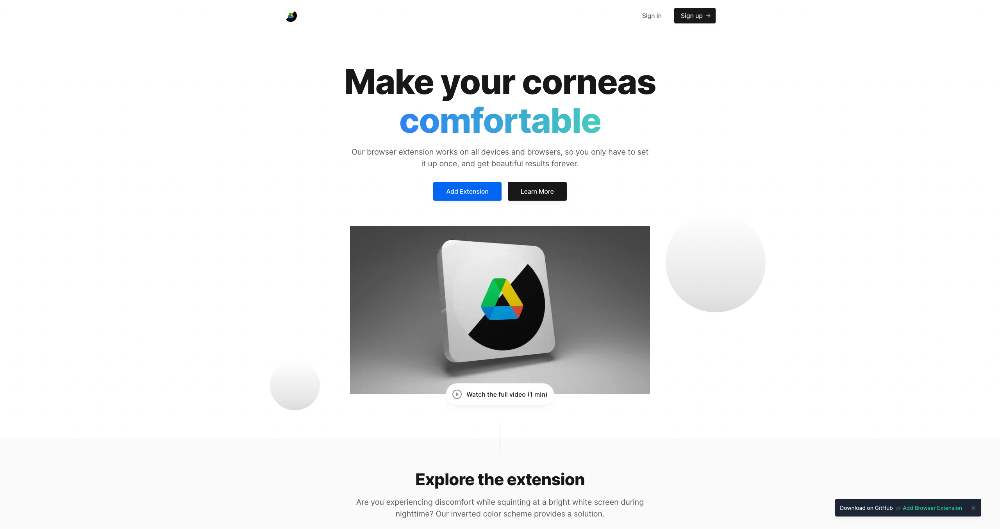

<div align="center">

  # [GSuiteDM Website](https://gsuitedm.netlify.app)

  <!-- [](https://app.netlify.com/sites/yassertabora/deploys) -->

  **GSuiteDM main website landing page is built using ReactJS, React Router, and Vanilla JavaScript**

  | :warning: | **gsuitedm.netlify.app's code is in the dev branch. Commits to the main branch will be ignored.** <br> | &nbsp;&nbsp;&nbsp;&nbsp;[CONTRIBUTE](#)&nbsp;&nbsp;&nbsp;&nbsp; |
  | --------- | :--------------------------------------------------------------------------------------------------- | --------------------------------------------------------------------------------------------------------------------- |

  
</div>

## Build Setup

```bash
# install dependencies
$ npm install

# serve with hot reload at localhost:3000
$ npm run dev

# generate static project
$ npm run build
```

For detailed explanation on how things work, check out the [documentation](https://react.dev/).

## Recommended VSCode Setup

- [ESLint](https://marketplace.visualstudio.com/items?itemName=dbaeumer.vscode-eslint) `ext install dbaeumer.vscode-eslint`
- [Prettier](https://marketplace.visualstudio.com/items?itemName=esbenp.prettier-vscode) `ext install esbenp.prettier-vscode`

> `Ctrl(Cmd)` + `Shift` + `P` > Open Settings (JSON)

```
"editor.formatOnSave": true,
"editor.codeActionsOnSave": {
  "source.fixAll.eslint": true
}
```

## Special Directories

### `public`

The public directory contains your uncompiled assets such as images and/or fonts.

### `components`

The components directory contains your NextJS components. Components make up the different parts of your page and can be reused and imported into your pages, layouts and even other components.

### `app`

The app directory is the main directory for your Next.js application. It contains all of the code that is necessary to run your application, including the pages, components, and styles.

This is a [Next.js](https://nextjs.org/) project bootstrapped with [`create-next-app`](https://github.com/vercel/next.js/tree/canary/packages/create-next-app).

## Getting Started

First, run the development server:

```bash
npm run dev
# or
yarn dev
# or
pnpm dev
```

Open [http://localhost:3000](http://localhost:3000) with your browser to see the result.

You can start editing the page by modifying `app/page.tsx`. The page auto-updates as you edit the file.

This project uses [`next/font`](https://nextjs.org/docs/basic-features/font-optimization) to automatically optimize and load Inter, a custom Google Font.

## Learn More

To learn more about Next.js, take a look at the following resources:

- [Next.js Documentation](https://nextjs.org/docs) - learn about Next.js features and API.
- [Learn Next.js](https://nextjs.org/learn) - an interactive Next.js tutorial.

You can check out [the Next.js GitHub repository](https://github.com/vercel/next.js/) - your feedback and contributions are welcome!

## Deploy on Vercel

The easiest way to deploy your Next.js app is to use the [Vercel Platform](https://vercel.com/new?utm_medium=default-template&filter=next.js&utm_source=create-next-app&utm_campaign=create-next-app-readme) from the creators of Next.js.

Check out our [Next.js deployment documentation](https://nextjs.org/docs/deployment) for more details.
